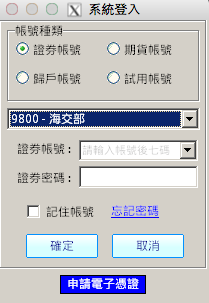

# Running Windows application on Mac

無可避免就是有那麼幾次需要這些 Windows Application, 像是

* VMware vSphere Client 管理 ESXi
* 證券軟體
* 報稅軟體
* ...

但又不想在 Mac 上直接裝 Wine 或 Windows VM, 只好透過 Docker 包 Wine 試試看

# Usage

Install docker/X Window on Mac

    brew install socat docker docker-machine
    brew cask install xquartz

start your docker vm

    docker-machine create --driver virtualbox dev
    eval "$(docker-machine env dev)"

run wine container

    # VBOXNET_IP is your vboxnetX's IP on your mac
    VBOXNET_IP=192.168.99.1
    socat TCP-LISTEN:6000,bind=${VBOXNET_IP},reuseaddr,fork UNIX-CLIENT:\"$DISPLAY\"
    # put your Windows application on Downloads folder or somewhere
    docker run -it -e DISPLAY=${VBOXNET_IP}:0 -v /Users/james/Downloads:/software --name=wine cmaohuang/wine /bin/bash

Initialize Wine

    wine wineboot --init
    # launch notepade for testing
    wine notepad.exe

Install vSphere Client

    cd /software
    wine VMware-viclient-all-6.0.0-3016447.exe

    # 安裝到最後會出現 hcmon 錯誤, 但別急著按 button
    "hcmon driver failed to install" error, don't click ok

    # 透過 docker exec 把 .wine 目錄先 rename, 按完 button 在 rename 回來
    docker exec -it wine bash
    mv ~/.wine ~/.wine-tmp
    click ok
    mv ~/.wine-tmp ~/.wine

    # install .NET Framework 2.0, Visual J#
    winetricks dotnet20 vjrun20

    cd ~/.wine/drive_c/Program\ Files/VMware/Infrastructure/Virtual\ Infrastructure\ Client/Launcher/
    wine VpxClient.exe

Install 元大證券[點精靈](http://www.yuanta.com.tw/pages/static-pages/service/product1_2.aspx?Node=ee7fbf4c-e7ae-4bee-8077-c6ce1fc212bf&Show=LIST)

    # 匯入憑證
    wine control
    Internet Settings -> Content ->  Certificates -> Import

    cd /software
    wine EWinnerSetup\(F\).exe

    cd ~/.wine/drive_c/TWEWinner/
    wine EWinnerStart.exe

# Reference

* [suchja/wine](https://github.com/suchja/wine)
* [monokrome/docker-wine](https://github.com/monokrome/docker-wine)
* [wine - VMware vSphere Client](https://appdb.winehq.org/objectManager.php?sClass=application&iId=9860)
* [how to use -e DISPLAY flag on osx?](https://github.com/docker/docker/issues/8710)
